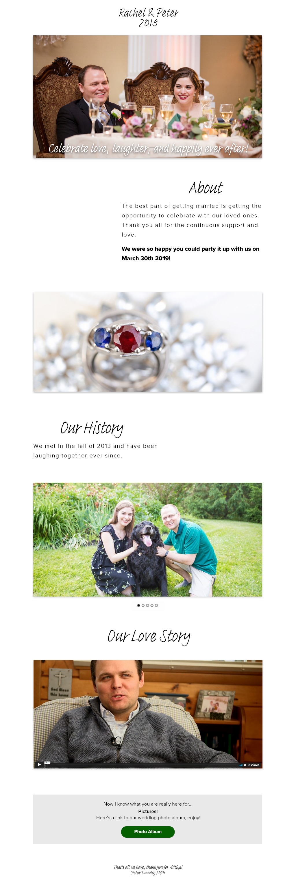

# Wedding Photo Gallery

A progressinve web application that contains multi sliders, videos, and downloadable photographs from my wedding.

## To Do

1. Upload photos for each section
2. Build out Slider Component -- with custom dots and download links
3. Write component tests
4. Integrate PWA configs
5. Add a download link for the PWA
6. Push to hosting
7. Clean up README

## Motivation

## Build status

## Code style

## Screen shots

#### Homepage - Desktop & Tablet



#### Homepage - Mobile


#### Gallery - Desktop & Tablet


#### Gallery - Mobile

<sup>Coming soon...</sup>

## Tech used

## Install

```
git clone https://github.com/ptums/wedding-photo-gallery.git
cd wedding-photo-gallery
yarn install
```

## Tests

## Development

## Deployment


